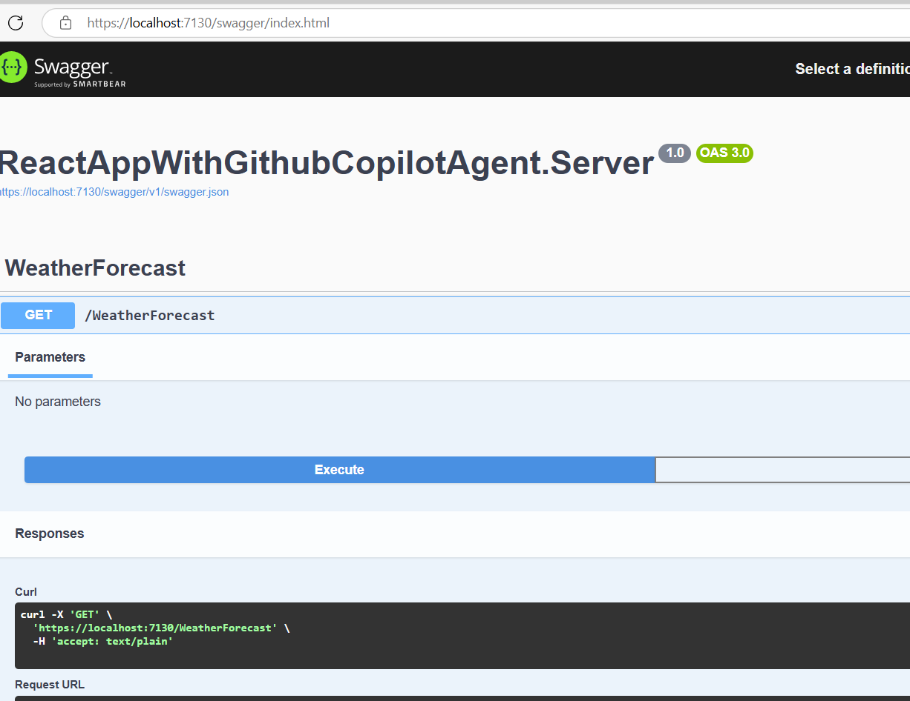

# React SPA App with ASP.NEt Core backend generated with Github Copilot Agent Mode

## Overview

This project is a full-stack web application built with a modern .NET and React architecture, designed for scalability, maintainability, and cloud readiness.
It was generated with Github Copilot Agent
---

## Solution Structure

- **Frontend**: `reactappwithgithubcopilotagent.client`
  - React application using TypeScript and Vite for fast development and builds.
  - ESLint configuration for code quality.
  - Fetches and displays weather information from the backend.

- **Backend**: `ReactAppWithGithubCopilotAgent.Server`
  - ASP.NET Core Web API (targeting .NET 8).
  - Provides API endpoints (e.g., weather data) to the frontend.
  - Includes Swagger/OpenAPI for API documentation.
  - Dockerfile for containerization.

- **App Host**: `ReactAppWithGithubCopilotAgent.AppHost`
  - Uses .NET Aspire (Aspire.AppHost.Sdk) to orchestrate and host the backend service.
  - Supports local development and service discovery.

- **Service Defaults**: `ReactAppWithGithubCopilotAgent.ServiceDefaults`
  - Shared configuration and extensions for resilience, health checks, OpenTelemetry, and service discovery.
  - Follows .NET Aspire best practices.

---

## Key Features

- **Modern Frontend**: Fast, type-safe React app with Vite and TypeScript.
- **Robust Backend**: .NET 8 Web API with best practices for API development.
- **Cloud-Ready**: Docker support and Aspire orchestration for easy deployment and scalability.
- **Observability**: Integrated health checks and OpenTelemetry for monitoring.
- **Maintainability**: Shared service defaults and configuration for consistency across services.

---

## Getting Started

1. **Install Prerequisites**:
   - [.NET 8 SDK](https://dotnet.microsoft.com/download)
   - [Node.js & npm](https://nodejs.org/)

2. **Restore and Build**:
   - Restore NuGet packages and build the .NET solution:
     ```powershell
     dotnet restore
     dotnet build
     ```
   - Install frontend dependencies:
     ```powershell
     cd reactappwithgithubcopilotagent.client
     npm install
     ```

3. **Run the Application**:
   - Start the backend:
     ```powershell
     dotnet run --project ReactAppWithGithubCopilotAgent.Server
     ```
   - In a new terminal, start the frontend:
     ```powershell
     cd reactappwithgithubcopilotagent.client
     npm run dev
     ```

4. **Access the App**:
   - Frontend: [http://localhost:5173](http://localhost:5173) (default Vite port)
   - Backend API/Swagger: [https://localhost:5001/swagger](https://localhost:5001/swagger) (or as configured)

---

## Project Highlights

- **.NET Aspire**: Used for orchestrating services, enabling service discovery, and providing a foundation for cloud-native development.
- **OpenTelemetry**: Built-in support for distributed tracing and observability.
- **Service Discovery & Resilience**: Shared defaults for robust microservice communication.
- **Docker Support**: Easily containerize and deploy the backend.

---

## Using Agent Mode and MCP in Visual Studio

You can extend GitHub Copilot's capabilities in Visual Studio by enabling Agent Mode and connecting to MCP (Model Context Protocol) servers, such as the official GitHub MCP server. This allows Copilot to interact with external tools (like GitHub issues, pull requests, and more) directly from your IDE.

### Prerequisites
- Visual Studio 2022 version 17.14 or later
- GitHub account with Copilot access
- Enable Agent Mode in Visual Studio: Go to `Tools > Options > GitHub > Copilot > Copilot Chat` and set "Enable agent mode" in the chat pane.

### Configuration Steps
1. **Create MCP Configuration File**
   - In your solution root, create a file named `.mcp.json`.
   - Example configuration for the GitHub MCP server:
     ```json
     {
       "inputs": [
         {
           "id": "github_pat",
           "description": "GitHub personal access token",
           "type": "promptString",
           "password": true
         }
       ],
       "servers": {
         "github": {
           "type": "stdio",
           "command": "docker",
           "args": [
             "run",
             "-i",
             "--rm",
             "-e",
             "GITHUB_PERSONAL_ACCESS_TOKEN",
             "ghcr.io/github/github-mcp-server"
           ],
           "env": {
             "GITHUB_PERSONAL_ACCESS_TOKEN": "${input:github_pat}"
           }
         }
       }
     }
     ```
   - Add this file to Solution Items in Solution Explorer if you want to track it in source control.

2. **Get a GitHub Personal Access Token**
   - Generate a token at [GitHub Personal Access Tokens](https://github.com/settings/personal-access-tokens) with appropriate scopes.

3. **Enable and Use Agent Mode**
   - In Visual Studio, open the Copilot Chat window, click the `Ask` dropdown, and select `Agent`.
   - When prompted, paste your personal access token.
   - Select the tools you'd like to use (e.g., `list_issues`).
   - Try prompts like: `list issues assigned to me on GitHub`.
   - When Copilot requests permission to use a tool, select the desired approval scope.

#### More Information
- [Official documentation](https://learn.microsoft.com/en-us/visualstudio/ide/mcp-servers?view=vs-2022)
- [GitHub MCP server repository](https://github.com/github/github-mcp-server)
- [Model Context Protocol specification](https://modelcontextprotocol.io/specification/)

---

## Using Agent Mode and MCP in Visual Studio Code

Visual Studio Code also supports Agent Mode and MCP integration, allowing you to use GitHub Copilot with external tools and workflows directly from VS Code.

### Prerequisites
- Visual Studio Code (latest version recommended)
- GitHub Copilot extension installed
- Docker installed (for running the MCP server)
- GitHub account with Copilot access

### Configuration Steps
1. **Install the GitHub Copilot Extension**
   - Go to the Extensions view (`Ctrl+Shift+X`) and search for "GitHub Copilot". Install the extension.

2. **Create MCP Configuration File**
   - In your workspace root, create a `.mcp.json` file with the following content:
     ```json
     {
       "inputs": [
         {
           "id": "github_pat",
           "description": "GitHub personal access token",
           "type": "promptString",
           "password": true
         }
       ],
       "servers": {
         "github": {
           "type": "stdio",
           "command": "docker",
           "args": [
             "run",
             "-i",
             "--rm",
             "-e",
             "GITHUB_PERSONAL_ACCESS_TOKEN",
             "ghcr.io/github/github-mcp-server"
           ],
           "env": {
             "GITHUB_PERSONAL_ACCESS_TOKEN": "${input:github_pat}"
           }
         }
       }
     }
     ```

3. **Generate a GitHub Personal Access Token**
   - Visit [GitHub Personal Access Tokens](https://github.com/settings/personal-access-tokens) and create a token with the required scopes.

4. **Enable Agent Mode in Copilot Chat**
   - Open the Copilot Chat panel in VS Code.
   - Click the `Ask` dropdown and select `Agent`.
   - When prompted, enter your GitHub personal access token.
   - Select the tools you want to enable (e.g., `list_issues`).
   - Try prompts such as: `list issues assigned to me on GitHub`.
   - Approve tool usage when Copilot requests permission.

#### More Information
- [Official documentation](https://learn.microsoft.com/en-us/visualstudio/ide/mcp-servers?view=vs-2022)
- [GitHub MCP server repository](https://github.com/github/github-mcp-server)
- [Model Context Protocol specification](https://modelcontextprotocol.io/specification/)

---

## Backend API in Swagger UI

The image below shows the backend API (WeatherForecast) exposed and documented in Swagger UI:



---

## References
- [Vite](https://vitejs.dev/)
- [React](https://react.dev/)
- [.NET Aspire](https://learn.microsoft.com/dotnet/aspire/)
- [OpenTelemetry](https://opentelemetry.io/)
- [ASP.NET Core](https://learn.microsoft.com/aspnet/core/)
- **MCP - Model Context Protocol**: [https://learn.microsoft.com/en-us/visualstudio/ide/mcp-servers?view=vs-2022](https://learn.microsoft.com/en-us/visualstudio/ide/mcp-servers?view=vs-2022)

---

*Generated on May 23, 2025*
